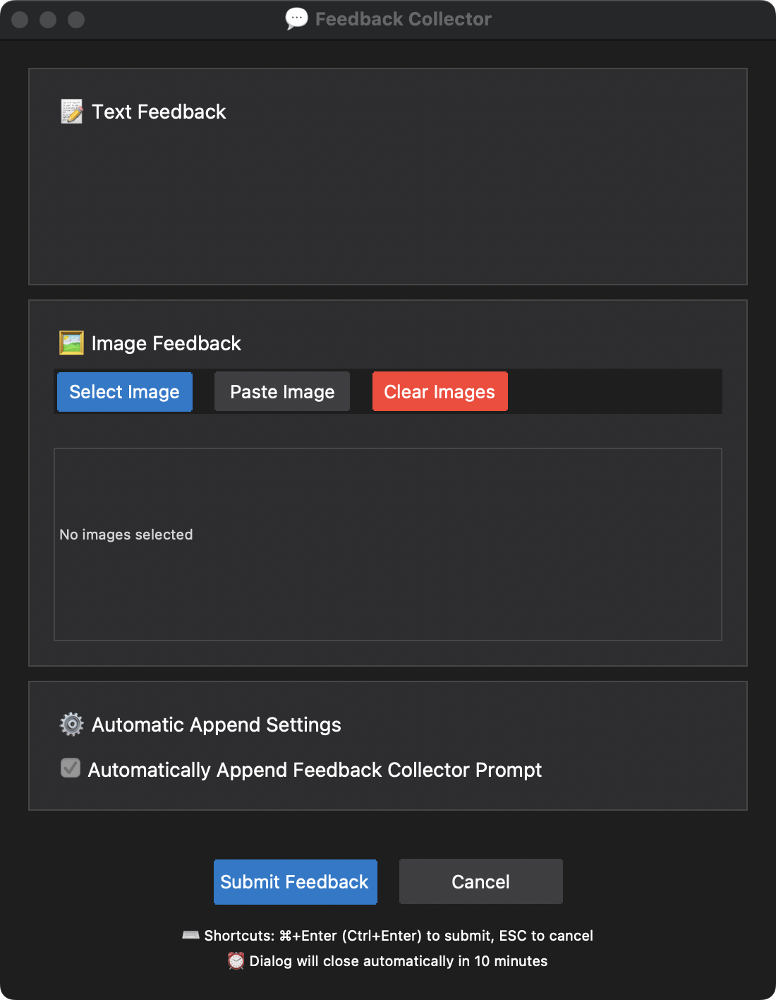

# MCP Feedback Collector

[中文版本](README_CN.md) | **English Version**

A feedback collection tool that supports text and image feedback with a dark theme design.

<table>
  <tr>
    <td align="center"><b>Chinese Interface</b></td>
    <td align="center"><b>English Interface</b></td>
  </tr>
  <tr>
    <td></td>
    <td></td>
  </tr>
</table>

## Why Do You Need This Tool?

When using Cursor, you may have noticed that AI assistants often stop after completing a single task, even though a single request can still use many more tool calls. This leads to resource waste, as each request can theoretically call up to 25 tools.

The core purpose of this MCP tool is:
- 🔄 **Continue Conversations**: In a single fast Request, ensure the AI actively calls this MCP tool to collect feedback after completing tasks (instead of simply terminating the conversation), allowing for subsequent tasks
- 🔥 **Maximize Utilization**: Let each fast Request **fully utilize the 25 tool calls** quota
- 💰 **Optimize Costs**: Maximize the value return of each fast Request

## Before vs After Comparison

|  | <div align="center">Before</div> | <div align="center">After</div> |
|--|--------|--------|
| **Workflow** | <div align="center">Input in Agent mode: Complete &lt;Task 1&gt;</div><div align="center">⬇</div><div align="center">Task completed, this fast request ends</div> | <div align="center">Input in Agent mode: Complete &lt;Task 1&gt;</div><div align="center">⬇</div><div align="center">Task completed, call feedback collector for feedback</div><div align="center">⬇</div><div align="center">Input in MCP tool: Complete &lt;Task 2&gt;</div><div align="center">⬇</div><div align="center">Task completed, call feedback collector for feedback</div><div align="center">⬇</div><div align="center">Input in MCP tool: Complete &lt;Task 3&gt;</div><div align="center">⬇</div><div align="center">Task completed, call feedback collector for feedback</div><div align="center">⬇</div><div align="center">Input in MCP tool: Complete &lt;Task 4&gt;</div><div align="center">⬇</div><div align="center">Task completed, call feedback collector for feedback</div><div align="center">⬇</div><div align="center">Input in MCP tool: Complete &lt;Task 5&gt;</div><div align="center">⬇</div><div align="center">Task completed, call feedback collector for feedback</div><div align="center">⬇</div><div align="center">Input in MCP tool: Complete &lt;Task 6&gt;</div><div align="center">⬇</div><div align="center">...until reaching 25 tool call limit</div> |
| **Request Consumption** | <div align="center">Consumes 1 Request</div> | <div align="center">Consumes 1 Request</div> |

## Features

- 🎨 **Dark Theme Interface**: Dark color scheme consistent with Cursor editor
- 📝 **Multi-line Text Feedback**: Support for multi-line text input and editing
- 🖼️ **Image Feedback Support**: Support for image selection and clipboard pasting, including image thumbnail display and deletion
- 🌍 **Chinese/English Interface Toggle**: Support for interface language switching
- ⌨️ **Keyboard Shortcuts**: Quick submit (⌘+Enter/Ctrl+Enter) and cancel (ESC) operations

## System Requirements

- Python 3.8+
- tkinter (usually installed with Python)
- Environment with GUI support

## Installation

1. **Clone Repository**
```bash
git clone <repository-url>
cd feedback_collector
```

2. **Create Virtual Environment**
```bash
conda create -n feedback_collector python=3.11
conda activate feedback_collector
```

3. **Install Dependencies**
```bash
pip install -r requirements.txt
```

## MCP Configuration

Add the following configuration to Cursor's MCP configuration file:

```json
{
  "mcpServers": {
    "feedback-collector": {
      "command": "/path/to/your/python",
      "args": ["-m", "src.server"],
      "cwd": "/path/to/feedback_collector",
      "env": {
        "MCP_DIALOG_TIMEOUT": "600",
        "LANGUAGE": "EN"
      }
    }
  }
}
```

**Configuration Description**:
- `command`: Python interpreter path
- `cwd`: Absolute path to project root directory
- `MCP_DIALOG_TIMEOUT`: Dialog timeout in seconds, default 600 seconds
- `LANGUAGE`: Interface language, `CN` (Chinese) or `EN` (English)

### Getting Paths

```bash
# Get Python path
conda activate feedback_collector
which python

# Get project path
cd /path/to/feedback_collector
pwd
```

## Project Rules Configuration

Add the following rules to Cursor's Project Rules (set Rule Type to Always) to ensure automatic feedback collection after each task completion:

```
Any time you need to ask the user a question, make sure to use the <feedback-collector.collect_feedback> MCP.

After completing each user-specified task, the <feedback-collector.collect_feedback> mcp tool must be used to collect user feedback.

Before finishing a user Request, make sure to call the <feedback-collector.collect_feedback> MCP rather than just ending the task.

Keep calling <feedback-collector.collect_feedback> MCP until the user's feedback is empty, then end the Request.

If the ongoing task involves UI modifications, you should only complete the user's coding task and must not perform testing yourself. The correct approach is to prompt the user to test it themselves, and then use the <feedback-collector.collect_feedback> MCP tool to obtain their feedback.
```

**Configuration Steps**:
1. Open Cursor settings
2. Find Project Rules option
3. Add new rule and paste the above content
4. Set Rule Type to `Always`
5. Save configuration

## MCP Tools

### collect_feedback()
Main tool for collecting user feedback:
- Display feedback collection interface
- Support text and image feedback
- Return structured feedback data

## Usage

1. Complete the above MCP configuration and Project Rules configuration
2. In conversations with AI, the AI will automatically call the feedback collector after completing current tasks (instead of simply terminating the conversation)
3. Enter text feedback or add images in the popup dialog
4. Use shortcut `⌘+Enter` (Mac) or `Ctrl+Enter` (Windows/Linux) to submit feedback; press `ESC` to cancel
5. AI will continue subsequent operations based on feedback (to achieve full utilization of up to 25 tool calls per single request)

## Project Structure

```
feedback_collector/
├── README.md                 # Project documentation (English)
├── README_CN.md              # Project documentation (Chinese)
├── requirements.txt          # Dependencies list
└── src/                     # Source code directory
    ├── server.py            # MCP server entry point
    ├── ui/                  # UI modules
    │   ├── theme.py         # Dark theme management
    │   ├── components.py    # macOS style components
    │   └── feedback_dialog.py # Feedback collection dialog
    ├── core/                # Core business logic
    │   ├── feedback_collector.py # Feedback collector
    │   └── image_handler.py # Image processing
    └── utils/               # Utility functions
        ├── gui_utils.py     # GUI utility functions
        └── i18n.py          # Internationalization support
``` 