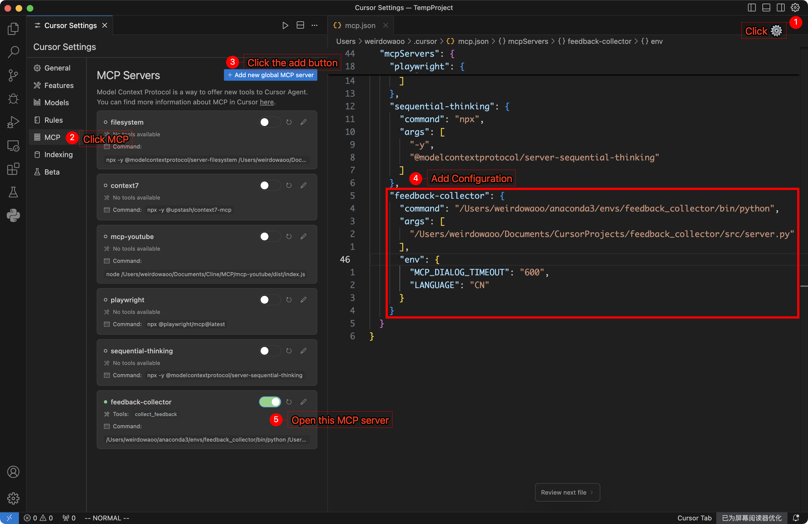

# MCP 反馈收集器

**中文版本** | [English Version](README.md)

反馈收集工具，支持文字和图片反馈，采用深色主题设计。

<table>
  <tr>
    <td align="center"><b>中文界面</b></td>
    <td align="center"><b>英文界面</b></td>
  </tr>
  <tr>
    <td></td>
    <td></td>
  </tr>
</table>

## 为什么需要这个工具？

在使用 Cursor 时，您可能注意到 AI 助手经常在完成一次任务后就停止了，即使单次请求还有很多工具调用次数可以使用。这导致了资源浪费，因为每次请求理论上可以调用多达 25 次工具。

本 MCP 工具的核心作用是：
- 🔄 **延续对话**：在一次快速 Request 请求中，确保 AI 在完成任务后主动调用本 MCP 工具收集反馈（而不是简单终止本轮对话），以便继续后续任务
- 🔥 **物尽其用**：让每次快速 Request 请求都能**充分利用 25 次工具**调用配额
- 💰 **优化成本**：最大化每次快速 Request 请求的价值回报

## 使用前后对比

|  | <div align="center">使用前</div> | <div align="center">使用后</div> |
|--|--------|--------|
| **工作流程** | <div align="center">在 Agent 模式下输入：完成 &lt;任务 1&gt;</div><div align="center">⬇</div><div align="center">任务完成，本次快速请求结束</div> | <div align="center">在 Agent 模式下输入：完成 &lt;任务 1&gt;</div><div align="center">⬇</div><div align="center">任务完成，调用反馈收集器获取反馈</div><div align="center">⬇</div><div align="center">在 MCP 工具中输入：完成 &lt;任务 2&gt;</div><div align="center">⬇</div><div align="center">任务完成，调用反馈收集器获取反馈</div><div align="center">⬇</div><div align="center">在 MCP 工具中输入：完成 &lt;任务 3&gt;</div><div align="center">⬇</div><div align="center">任务完成，调用反馈收集器获取反馈</div><div align="center">⬇</div><div align="center">在 MCP 工具中输入：完成 &lt;任务 4&gt;</div><div align="center">⬇</div><div align="center">任务完成，调用反馈收集器获取反馈</div><div align="center">⬇</div><div align="center">在 MCP 工具中输入：完成 &lt;任务 5&gt;</div><div align="center">⬇</div><div align="center">任务完成，调用反馈收集器获取反馈</div><div align="center">⬇</div><div align="center">在 MCP 工具中输入：完成 &lt;任务 6&gt;</div><div align="center">⬇</div><div align="center">...直到达到 25 次工具调用限额</div> |
| **消耗 Request 统计** | <div align="center">消耗 1 次 Request</div> | <div align="center">消耗 1 次 Request</div> |

## 特性

- 🎨 **深色主题界面**：与 Cursor 编辑器一致的深色配色方案
- 📝 **多行文本反馈**：支持多行文本输入和编辑
- 🖼️ **图片反馈支持**：支持图片选择和剪贴板粘贴，包含图片缩略图显示和删除功能
- 🌍 **中英文界面切换**：支持界面语言切换
- ⌨️ **快捷键支持**：快速提交（⌘+Enter/Ctrl+Enter）和取消（ESC）操作

## 系统要求

- Python 3.8+
- tkinter（通常随 Python 安装）
- 支持图形界面的环境

## 安装

1. **克隆仓库**
```bash
git clone <repository-url>
cd feedback_collector
```

2. **创建虚拟环境**
```bash
conda create -n feedback_collector python=3.11
conda activate feedback_collector
```

3. **安装依赖**
```bash
pip install -r requirements.txt
```

## MCP 配置

在 Cursor 的 MCP 配置文件中添加以下配置：

```json
{
  "mcpServers": {
    "feedback-collector": {
      "command": "/path/to/your/python",
      "args": ["-m", "src.server"],
      "cwd": "/path/to/feedback_collector",
      "env": {
        "MCP_DIALOG_TIMEOUT": "600",
        "LANGUAGE": "CN"
      }
    }
  }
}
```

**配置说明**：
- `command`: Python 解释器路径
- `cwd`: 项目根目录的绝对路径
- `MCP_DIALOG_TIMEOUT`: 对话框超时时间（秒），默认 600 秒
- `LANGUAGE`: 界面语言，`CN`（中文）或 `EN`（英文）



### 获取路径

```bash
# 获取 Python 路径
conda activate feedback_collector
which python

# 获取项目路径
cd /path/to/feedback_collector
pwd
```

## Project Rules 配置

在 Cursor 的 Project Rules 中添加以下规则（Rule Type 设置为 Always），确保每次任务完成后自动收集反馈：

```
Any time you need to ask the user a question, make sure to use the <feedback-collector.collect_feedback> MCP.

After completing each user-specified task, the <feedback-collector.collect_feedback> mcp tool must be used to collect user feedback.

Before finishing a user Request, make sure to call the <feedback-collector.collect_feedback> MCP rather than just ending the task.

Keep calling <feedback-collector.collect_feedback> MCP until the user's feedback is empty, then end the Request.

If the ongoing task involves UI modifications, you should only complete the user's coding task and must not perform testing yourself. The correct approach is to prompt the user to test it themselves, and then use the <feedback-collector.collect_feedback> MCP tool to obtain their feedback.
```

**配置步骤**：
1. 打开 Cursor 设置
2. 找到 Project Rules 选项
3. 添加新规则，将上述内容粘贴进去
4. 将 Rule Type 设置为 `Always`
5. 保存配置


## MCP 工具

### collect_feedback()
收集用户反馈的主要工具：
- 显示反馈收集界面
- 支持文字和图片反馈
- 返回结构化的反馈数据

## 使用方法

1. 完成上述 MCP 配置和 Project Rules 配置
2. 在与 AI 的对话中，AI 完成当前任务后会自动调用反馈收集器（而不是简单终止本轮对话）
3. 在弹出的对话框中输入文字反馈或添加图片
4. 使用快捷键 `⌘+Enter` （ Mac ）或 `Ctrl+Enter` （ Windows/Linux ）提交反馈；按 `ESC` 键取消操作
5. AI 会基于反馈继续进行后续操作（以达到充分利用单次请求最多 25 次工具调用的目的）

## 项目结构

```
feedback_collector/
├── README.md                 # 项目说明（英文）
├── README_CN.md              # 项目说明（中文）
├── requirements.txt          # 依赖列表
└── src/                     # 源代码目录
    ├── server.py            # MCP 服务器入口
    ├── ui/                  # 界面模块
    │   ├── theme.py         # 深色主题管理
    │   ├── components.py    # macOS 风格组件
    │   └── feedback_dialog.py # 反馈收集对话框
    ├── core/                # 核心业务逻辑
    │   ├── feedback_collector.py # 反馈收集器
    │   └── image_handler.py # 图片处理
    └── utils/               # 工具函数
        ├── gui_utils.py     # GUI 工具函数
        └── i18n.py          # 国际化支持
```
